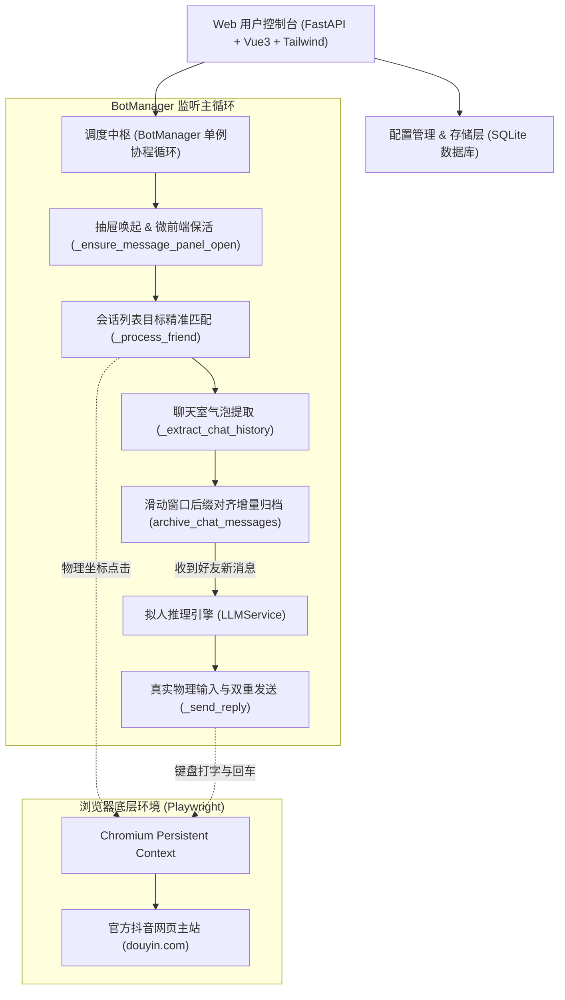

# 抖音自动回复 (欢迎各位加入LINUX DO 社区 linux.do）

<p align="center">
  
  
  
  
  
  
</p>

<p align="center">
  <b>基于 Playwright 真实持久化浏览器驱动的抖音（PC 网页端）自动化高拟人私信替身系统。</b><br>
  配备多轮长效历史对话归档、专属事实记忆库与现代化 Web 单页管理控制台。
</p>

---

## 💡 为什么需要它？

很多恋人、好友习惯在抖音上分享搞笑视频、生活碎片与即时查岗（*“在干嘛呢”、“你看这个小狗好搞笑”、“今晚吃什么”*）。  
如果打游戏或写代码时未能及时回复，往往演变成送命题；但如果套用常规的人工客服或粗制滥造的 Bot，冷冰冰的“亲亲/有什么可以帮您”或胡编现实细节则会**直接物理级穿帮**。


---


## 🏗️ 系统架构图



---

## 🚀 极速上手体验

### 1. 环境准备与依赖安装
确保本地安装有 **Python 3.10 或更高版本**：
```bash
# 克隆仓库
git clone https://github.com/popohuan/douyin-girlfriend-bot.git
cd douyin-girlfriend-bot

# 安装依赖
pip install -r requirements.txt

# 安装 Playwright 浏览器内核
playwright install chromium
```

### 2. 扫码登录抖音账号
系统提供了一键弹窗扫码向导：
- **Windows 用户**：直接双击根目录下的 **`login_browser.bat`**；
- **命令行用户**：执行 `python -X utf8 login_browser.py`；
- 电脑将自动拉起 Chrome 浏览器并唤起登录二维码，打开手机【抖音 App】扫码并确认登录即可。

### 3. 启动管理控制台
- **Windows 用户**：双击 **`start_windows.bat`**；
- **Linux / macOS 用户**：执行 `./start_linux.sh` 或 `python -X utf8 server.py`；
- 打开浏览器访问管理后台：  
  👉 **`http://127.0.0.1:8000`**

### 4. 填入 API Key 与开启监听
1. 进入 **【全局与模型设置】**，填写你的 **DeepSeek API Key**（或任何兼容 OpenAI 格式的模型密钥），点击保存；
2. 进入 **【好友计划 & 专属资料库】**，添加或修改好友昵称（需与抖音好友昵称完全一致），选择或自定义人设模版；
3. 点击顶部右上角绿色的 **【启动监听】**，系统即刻进入全自动高拟人回复监控！

---

## 📂 项目文件结构

```text
douyin-girlfriend-bot/
├── server.py                        # FastAPI 服务端，提供 RESTful API 与静态页面挂载
├── bot_manager.py                   # Playwright 调度中枢，实现微前端保活、气泡提取与发送
├── database.py                      # SQLite 持久层，含序列对齐算法、长效历史与出厂预设
├── llm_service.py                   # 拟人大模型推理中枢，动态装配四层 Prompt 与历史切片
├── login_browser.py                 # 可视化弹窗扫码登录向导 (Python)
├── login_browser.bat                # Windows 一键双击扫码登录快捷方式
├── login_helper.py                  # 底层登录凭据捕获、Cookie 导出与校验库
├── run_login.py                     # CLI 登录与凭据清理入口
├── package_project.py               # 项目脱敏全量打包工具
├── requirements.txt                 # Python 依赖清单
├── start_windows.bat                # Windows 一键启动服务
├── start_linux.sh                   # Linux / VPS 启动脚本
├── USAGE_GUIDE.md                   # 详细使用操作与实战手册
├── ARCHITECTURE_AND_IMPLEMENTATION.md # 全链路架构逆向与攻坚演进文档
├── static/
│   └── index.html                   # Vue3 + Tailwind CSS 单页现代化管理控制台
├── LICENSE                          # MIT 开源许可证
└── README.md                        # 项目主文档
```

---

## ⚙️ 内置官方预设模版

本系统出厂预置了经过实战检验的高拟真人设与事实档案模版，可在 Web 控制台一键套用：
1. **【年下男友/恋人】**：浓郁少年感、松弛粘人与偶尔嘴硬，口语倒装，内置防查岗打太极与两人专属生活习惯/黑历史档案；
2. **【亲弟血脉压制】**：极度冷漠嘲讽、惜字如金，专供拦截借钱与查岗踢皮球战术；

---

## 📖 深度进阶文档

- [完整使用操作指南 (USAGE_GUIDE.md)](USAGE_GUIDE.md)：涵盖环境部署、后台操作、历史对话管理、VPS 长期静默挂机（Systemd）与排查手册；
- [全链路架构与逆向攻坚历程 (ARCHITECTURE_AND_IMPLEMENTATION.md)](ARCHITECTURE_AND_IMPLEMENTATION.md)：复盘微前端 DOM 虚拟列表、React 18 合成事件、中轴线判定、会话穿透等七大技术死穴的攻坚全过程。

---

## ⚠️ 免责声明 (Disclaimer)

1. 本项目仅供 Python 自动化技术学习、大模型拟人化 Prompt 工程设计与前端 DOM 交互研究交流使用；
2. 请合理设置打字延迟与轮询时间，切勿用于批量垃圾消息营销或任何违反平台服务条款的行为；
3. **友情提示**：AI 终究是辅助，真诚沟通才是感情长久的基石。若因大模型即兴发挥导致感情纠纷、跪搓衣板等不可抗力事故，作者概不负责 😂。

---

## 📄 开源许可证

本项目基于 [MIT License](LICENSE) 开源。欢迎 Star、Fork 与提 Issue 交流！
